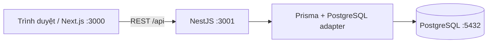

# Sơ đồ dự án

```mermaid
flowchart LR
  Browser[Trình duyệt / Next.js :3000] -->|REST /api| API[NestJS :3001]
  API --> Prisma[Prisma + PostgreSQL adapter]
  Prisma --> DB[(PostgreSQL :5432)]
```

ERD, Use Case và luồng trạng thái đơn hàng sẽ được cả nhóm chốt trước khi thêm model nghiệp vụ. Schema hiện tại chỉ có bảng SystemCheck để khởi tạo và kiểm chứng migration.
